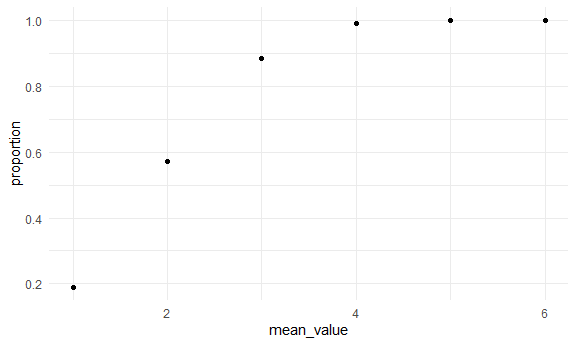
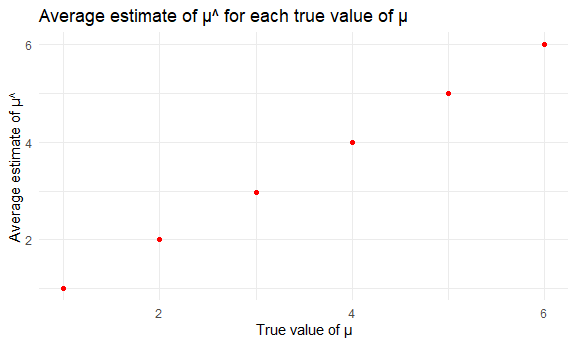
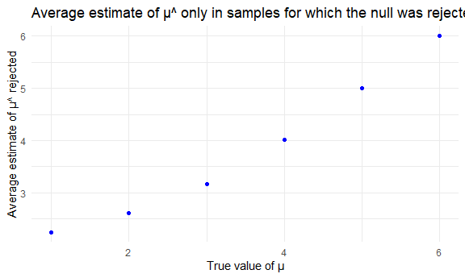

P8105_hw5_hm2900
================

## Problem 2

Describe the raw data. Create a `city_state` variable, and then
summarize within cities to obtain the total number of homicides and the
number of unsolved homicides.

``` r
homicide_df = 
  read_csv("./data/homicide-data.csv", na = c("", "Unknown")) %>%
  mutate(
    city_state = str_c(city, ", ", state),
    resolution = case_when(
      disposition == "Closed without arrest" ~ "unsolved", 
      disposition == "Open/No arrest" ~ "unsolved",
      disposition == "Closed by arrest" ~ "solved"
    )
  ) %>%
  relocate(city_state) %>%
  filter(city_state != "Tulsa, AL")

distinct_city = 
  homicide_df %>%
  distinct(city_state)

cities_df = homicide_df %>%
  group_by(city_state) %>%
  summarize(
    unsolved = sum(resolution == "unsolved"),
    total = n()
  )

cities_df
```

    ## # A tibble: 50 × 3
    ##    city_state      unsolved total
    ##    <chr>              <int> <int>
    ##  1 Albuquerque, NM      146   378
    ##  2 Atlanta, GA          373   973
    ##  3 Baltimore, MD       1825  2827
    ##  4 Baton Rouge, LA      196   424
    ##  5 Birmingham, AL       347   800
    ##  6 Boston, MA           310   614
    ##  7 Buffalo, NY          319   521
    ##  8 Charlotte, NC        206   687
    ##  9 Chicago, IL         4073  5535
    ## 10 Cincinnati, OH       309   694
    ## # … with 40 more rows

The data contains 52178 criminal homicides over the past decade in 50 of
the largest American cities. The data included the location of the
killing, reported date, basic information of the victim (name, race,
age, sex), whether an arrest was made and, in most cases, basic
demographic information about each victim.

For the city of Baltimore, MD, estimate the proportion of homicides that
are unsolved.

``` r
baltimore_md_df = 
  homicide_df %>%
  filter(city_state == "Baltimore, MD")

baltimore_md_summary = 
  baltimore_md_df %>%
  summarize(
    unsolved = sum(resolution == "unsolved"),
    total = n()
  )

baltimore_md_test = 
  prop.test(
    x = baltimore_md_summary %>% pull(unsolved),
    n = baltimore_md_summary %>% pull(total)
  ) %>%
  broom::tidy() %>%
  select(estimate, conf.low, conf.high)

baltimore_md_test
```

    ## # A tibble: 1 × 3
    ##   estimate conf.low conf.high
    ##      <dbl>    <dbl>     <dbl>
    ## 1    0.646    0.628     0.663

Now run prop.test for each of the cities in your dataset, and extract
both the proportion of unsolved homicides and the confidence interval
for each.

``` r
all_df = 
  cities_df %>%
  mutate(
    test_results = map2(unsolved, total, prop.test),
    tidy_results = map(test_results, broom::tidy)
  ) %>%
  select(city_state, tidy_results) %>%
  unnest(tidy_results) %>%
  select(city_state, estimate, conf.low, conf.high)

all_df
```

    ## # A tibble: 50 × 4
    ##    city_state      estimate conf.low conf.high
    ##    <chr>              <dbl>    <dbl>     <dbl>
    ##  1 Albuquerque, NM    0.386    0.337     0.438
    ##  2 Atlanta, GA        0.383    0.353     0.415
    ##  3 Baltimore, MD      0.646    0.628     0.663
    ##  4 Baton Rouge, LA    0.462    0.414     0.511
    ##  5 Birmingham, AL     0.434    0.399     0.469
    ##  6 Boston, MA         0.505    0.465     0.545
    ##  7 Buffalo, NY        0.612    0.569     0.654
    ##  8 Charlotte, NC      0.300    0.266     0.336
    ##  9 Chicago, IL        0.736    0.724     0.747
    ## 10 Cincinnati, OH     0.445    0.408     0.483
    ## # … with 40 more rows

Create a plot that shows the estimates and CIs for each city – check out
geom_errorbar for a way to add error bars based on the upper and lower
limits. Organize cities according to the proportion of unsolved
homicides.

``` r
all_df %>%
  mutate(city_state = fct_reorder(city_state, estimate)) %>%
  ggplot(aes(x = city_state, y = estimate)) +
  geom_point() +
  geom_errorbar(aes(ymin = conf.low, ymax = conf.high)) +
  theme(axis.text.x = element_text(angle = 90, vjust = 0.5, hjust = 1))
```


## Problem 3

First set the following design elements:

``` r
sim_normal_mean = function(n_obs = 30, mu, sigma = 5) {
  
  x = rnorm(n = n_obs, mean = mu, sd = sigma)
  
  x

}
```

Set μ=0. Generate 5000 datasets from the model. Save μ^ and the p-value
arising from a test of H:μ=0 using α=0.05.

``` r
sim_results_df = 
  expand_grid(
    mean_value = 0,
    interation = 1:5000
  ) %>%
  mutate(
    vect_num = map(.x = mean_value, ~sim_normal_mean(mu = .x))
  ) %>%
  mutate(
    estimate_df = map(vect_num, t.test),
    clean_output = map(estimate_df, broom::tidy) 
  ) %>%
  unnest(clean_output) %>%
  select(estimate, p.value)

sim_results_df
```

    ## # A tibble: 5,000 × 2
    ##    estimate p.value
    ##       <dbl>   <dbl>
    ##  1   0.396  0.576  
    ##  2  -0.838  0.363  
    ##  3  -2.23   0.00656
    ##  4  -0.415  0.690  
    ##  5   0.134  0.899  
    ##  6   1.24   0.159  
    ##  7   0.520  0.459  
    ##  8  -0.0599 0.946  
    ##  9  -0.766  0.422  
    ## 10   0.685  0.561  
    ## # … with 4,990 more rows

Repeat the above for μ={1,2,3,4,5,6}, and complete the following:

``` r
sim_results_changes_df = 
  expand_grid(
    mean_value = c(1, 2, 3, 4, 5, 6),
    interation = 1:5000
  ) %>%
  mutate(
    vect_num = map(.x = mean_value, ~sim_normal_mean(mu = .x))
  ) %>%
  mutate(
    estimate_df = map(vect_num, t.test),
    clean_output = map(estimate_df, broom::tidy) 
  ) %>%
  unnest(clean_output) %>%
  select(mean_value, estimate, p.value)
```

Make a plot showing the proportion of times the null was rejected (the
power of the test) on the y axis and the true value of μ on the x axis.
Describe the association between effect size and power.

``` r
sim_results_changes_df %>%
  mutate(
    rejection = case_when(
      p.value < 0.05 ~ 1, 
      p.value > 0.05 ~ 0
    )
  ) %>%
  group_by(mean_value) %>%
  summarize(
    reject = sum(rejection == 1),
    total = n(),
    proportion = reject / total
  ) %>%
  ggplot(aes(x = mean_value, y = proportion)) +
  geom_point()
```



Make a plot showing the average estimate of μ^ on the y axis and the
true value of μ on the x axis. Make a second plot (or overlay on the
first) the average estimate of μ^ only in samples for which the null was
rejected on the y axis and the true value of μ on the x axis.

``` r
sim_results_changes_df %>%
  group_by(mean_value) %>%
  summarize(
    average_estimate = mean(estimate)
  ) %>%
  ggplot(aes(x = mean_value, y = average_estimate)) +
  geom_point(color = "red") +
  labs(
    title = "Average estimate of μ^ for each true value of μ",
    x = "True value of μ",
    y = "Average estimate of μ^")
```



``` r
sim_results_changes_df %>%
  mutate(
    rejection = case_when(
      p.value < 0.05 ~ 1, 
      p.value > 0.05 ~ 0
    )
  ) %>%
  filter(rejection == 1) %>%
  group_by(mean_value) %>%
  summarize(
    average_estimate_reject = mean(estimate)
  ) %>%
  ggplot(aes(x = mean_value, y = average_estimate_reject)) +
  geom_point(color = "blue") +
  labs(
    title = "Average estimate of μ^ only in samples for which the null was rejected for each true value of μ",
    x = "True value of μ",
    y = "Average estimate of μ^ rejected")
```


